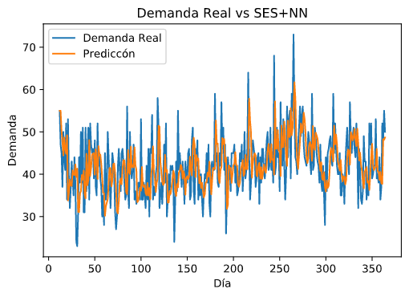

# Predicción de una serie temporal utilizando Simple Exponential Smoothing (SES) y Redes Neuronales Artificiales 

Utilizando tensorflow 2.x

En este trabajo se busca que una red neuronal elija el mejor valor de  de acuerdo a los valores de la serie tempora. Siguiendo la ecuacion:

En donde,  es el valor de suavización (smoothing),  son las observaciones de la serie temporal,  es el valor ponderado de las observaciones  en la serie.

Ejemplo de la predicción:

